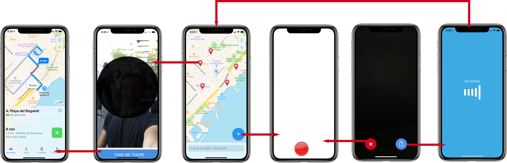

# What's Poppin?

Common project to work in the [Swift Peer Lab](https://swiftpeerlab.github.io).

## App Concept

A mobile app to discover what is happening in your city in real-time.

Users upload a short duration video of their experience, other users can see a list of experiences in a map and decide if they want to join them.

These experiences expire in a short amount of time to keep the information relevant to what is happening.

Users can give feedback on the experience in order to help improving the quality of the information.

Users can tag their experience and search for relevant terms.

## Wireframe

## Project Board

[Project Board](https://trello.com/b/O6UlEq42/poppin)

## Project Slack

[Join here](https://join.slack.com/t/swiftpeerlab/shared_invite/enQtMzU5MzE5ODY0OTk5LTA5NmJjZmZkMjg0NjhjNzVjNzA3MGU0MTFjNTUyZjdjMTg4ZjdjODcwZGEwNzA1ODU1ODIzNTNjNmY5MmRiMWE)

## Requirements

* macOS 10.13 or higher
* Xcode 9.3 or higher

## Installation

To compile/run the iOS application:
* open the Xcode Project "Poppin.xcodeproj"
* select the "Poppin" iOS scheme
* Run by pressing "Play" or by pressing [Cmd + R]

## Tests

We use [XCTest](https://developer.apple.com/documentation/xctest) for the Unit and UI tests.

To run the tests for the iOS application:
* open the Xcode Project "Poppin.xcodeproj"
* select the "Poppin" iOS scheme
* Run by pressing "Product" > "Test" or by pressing [Cmd + U]

## Contributing

We do all of our active development on the master branch. Your pull requests will automatically be targeted at that branch by Github. To make merging easier, be sure you create your branches based on the master branch.
